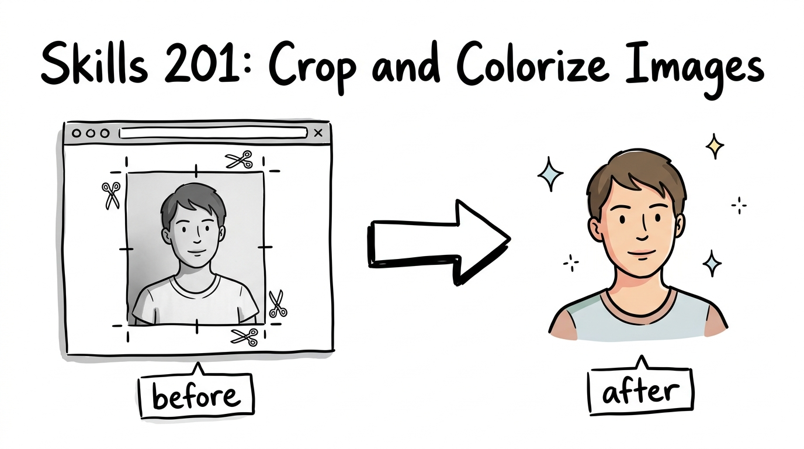

# Skills 201: Image Workflow Composition



[Python 3.10+](https://www.python.org/downloads/)
[License: MIT](./LICENSE)

`skills-201` builds on the `Skills 101` cropping example by composing multiple reusable skills into one workflow.

This project demonstrates three practical layers:

- `cropping-images`: crop images to the visible subject or frame
- `colorize-images`: colorize black and white images with the Gemini image API
- `process-bw-images`: a meta-skill that chains `cropping-images` and `colorize-images`

## Project Anatomy

- `.agents/skills/.../SKILL.md` explains when each skill should be used
- `.cursor/skills/.../SKILL.md` makes the same skills easy to reuse in Cursor projects
- `src/crop_images.py` handles cropping one or more local images in a folder
- `src/colorize_images.py` handles Gemini-powered image colorization
- `src/process_bw_images.py` remains as a legacy convenience wrapper for non-skill usage
- `requirements.txt` lists the runtime dependencies
- `pyproject.toml` exposes the primary crop and colorize CLIs

## Quick Start

### Install

#### macOS / Linux

```bash
python3 -m venv .venv
source .venv/bin/activate
python3 -m pip install -r requirements.txt
python3 -m pip install -e ".[dev]"
```

#### Windows PowerShell

```powershell
python -m venv .venv
.venv\Scripts\Activate.ps1
python -m pip install -r requirements.txt
python -m pip install -e ".[dev]"
```

### Configure Gemini

Create a `.env` file in the repo root:

```dotenv
GEMINI_API_KEY=your_api_key_here
GEMINI_IMAGE_MODEL=gemini-3.1-flash-image-preview
```

`src/colorize_images.py` and the chained workflow commands automatically read `GEMINI_API_KEY` from the environment, an explicit `--env-file`, `.env` in the current working directory, or `.env` in the repo root.

The default image model is `gemini-3.1-flash-image-preview`, the current Gemini 3.1 Flash Image preview model.

## Before And After

Original black and white source image:

Black and white source image

Cropped intermediate output:

Cropped black and white image

Final cropped and colorized output:

Cropped and colorized image

## Example Workflows

Crop only:

```bash
python3 src/crop_images.py --folder examples --keep-originals
```

This writes cropped JPG copies such as `black and white-cropped.jpg` next to the originals.

Colorize existing images into a separate folder:

```bash
python3 src/colorize_images.py --folder examples --output-dir examples/colorized
```

Colorize only the cropped outputs in a separate folder:

```bash
python3 src/colorize_images.py --folder examples --glob "*-cropped.jpg" --output-dir examples/colorized
```

Run crop and then colorize by chaining the lower-level workflows:

```bash
python3 src/crop_images.py --folder examples --keep-originals
python3 src/colorize_images.py --folder examples --glob "*-cropped.jpg" --output-dir examples/colorized
```

`src/process_bw_images.py` remains available as a legacy convenience CLI, but the primary `Skills 201` path is explicit composition of the lower-level skills.

## Primary Path

For this repo, the preferred end-to-end workflow is:

1. apply `cropping-images`
2. apply `colorize-images` to the `*-cropped.jpg` outputs

The installed CLI surface reflects that preference by exposing `crop-images` and `colorize-images` as the main commands.

## Skill Usage

If this is used as an agent skill, the user does not need to know the Python command.

They can simply say:

```text
Crop and colorize the image in `examples/black and white.png`, and save the outputs next to the original.
```

Other valid styles:

```text
Take the black and white image in `examples/black and white.png`, crop it to the portrait only, then create a colorized version.
```

```text
colorize-image
path: examples/black and white.png
save-next-to-original: true
```

For crop-only requests:

```text
Crop the image in `examples/black and white.png` so the portrait is the focus and save a cropped copy.
```

For colorize-only requests:

```text
Colorize the black and white image in `examples/black and white.png` and save the output next to the original.
```

For folder-based workflows:

```text
Use the images in `examples` as the source folder, apply the crop workflow to every source image, then colorize the results and keep the originals.
```

This is the main `Skills 201` idea:

- The user speaks naturally
- The skills can be composed
- The output stays consistent

## Security Notes

- Never commit `.env`.
- This repo includes `.env.example` only.
- The Gemini client fails closed when `GEMINI_API_KEY` is missing.
- The code never prints raw auth headers or API keys.
- Tests mock Gemini responses and do not make live API calls.

## Run Quality Checks

#### macOS / Linux

```bash
python3 -m ruff check .
python3 -m unittest discover -s tests -v
```

#### Windows PowerShell

```powershell
python -m ruff check .
python -m unittest discover -s tests -v
```

## Reusable Skills

This repo also includes reusable skills for flat Python CLI repo structure, fixture-based `unittest` patterns, and secure Gemini image client integration.